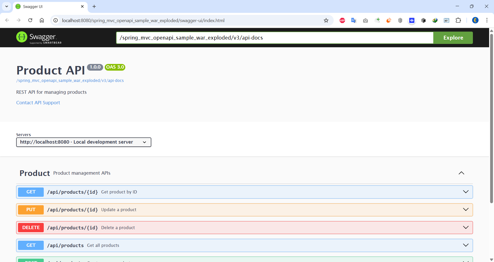

## Spring Web MVC ( not Spring Boot) with Swagger UI 

**Java 17 + Spring WebMVC 6.1.3**

### To run locally
 - Download Tomcat 10
 - Use run configuration with the project
 - Running Tomcat server will open http://localhost:8080/spring_mvc_openapi_sample_war_exploded/swagger-ui/index.html and explore path containing https://petstore.swagger.io/v2/swagger.json
 - Update explore path to **/spring_mvc_openapi_sample_war_exploded/v3/api-docs** to view swagger doc for our project

